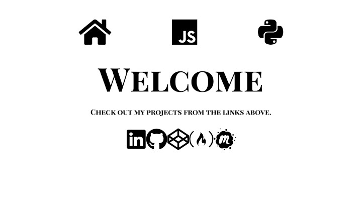

# Web Portfolio
[Wandal's web portfolio.](https://wmcooper2.com)

## Purpose/Goal
To show off what I've learned and what I can do to prospective employers.

## Operation
Click on the navigation links at the top or my social media accounts at the bottom.  
When you click on the project links, they will take you to either the project hosted on my own AWS Lightsail instances or to another site where I keep them like CodePen.

## Tech/Libraries Used
* HTML
* CSS
* JavaScript
* React
* Redux
* D3
* Node
* Express
* Python3
* Jupyter
* OpenCV
* and more...

## Problems/Solutions
_Will fill in this section after my updates are finished (May 24th, 2020)_

## More Information
[LinkedIn](https://www.linkedin.com/in/wmcooper2/)
[Github](https://github.com/wmcooper2)
[CodePen](https://codepen.io/wmcooper2)
[Free Code Camp](https://www.freecodecamp.org/wmcooper2)
[Meetup](https://www.meetup.com/members/220584428/)
